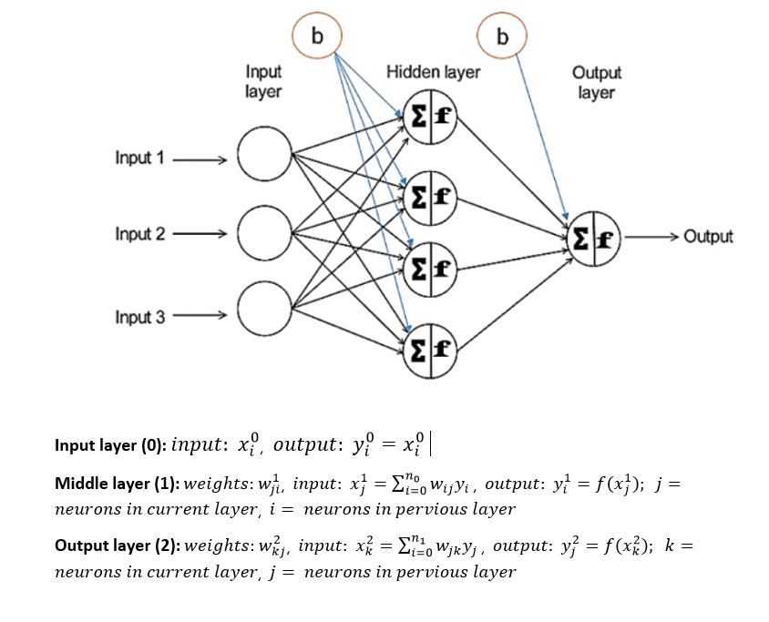
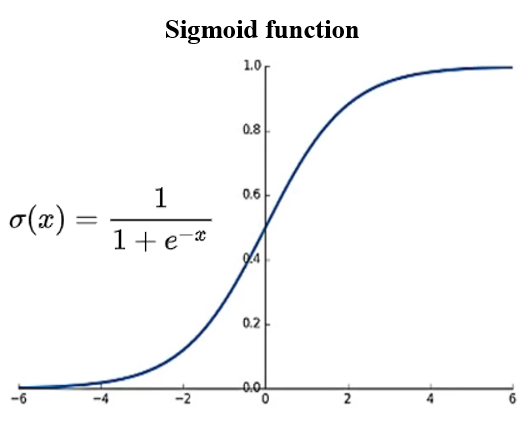
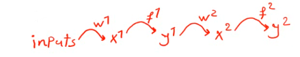
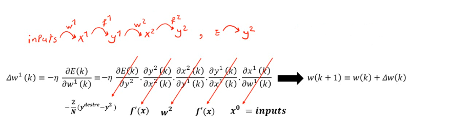
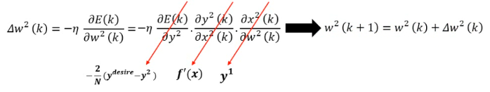

# Neural Network from Scratch

Here, I developed a four-layer NN without using Python libraries.

Below is the shematic of a three-layer network.



#### We only import Numpy and Pandas libraries for data loading!


```python
import numpy as np
import pandas as pd
```

## Training

### Data Loading
###### Here, I used my seismic attributes at well locations!
###### You can easiliy replace your excel file name and use the network for training your data!


```python
file = pd.read_excel('F:/KrigNN/SeismicInWells_AllSar10.xlsx')
data = file.to_numpy()
inputs = data[:, :6] 
outputs = data[:, 6]
```

### Shufflling


```python
per_list = np.random.permutation(len(data))
inputs_sh = []
outputs_sh = []
for i in range(len(data)):
    per_indx = per_list[i]
    tmp_input = inputs[per_indx]
    tmp_output = outputs[per_indx]
    inputs_sh.append(tmp_input)
    outputs_sh.append(tmp_output)

inputs_sh = np.array(inputs_sh)
outputs_sh = np.array(outputs_sh)

```

### Normalizing


```python
min_vec = inputs_sh.min(axis=0)
max_vec = inputs_sh.max(axis=0)
inputs_sh = (inputs_sh - min_vec)/(max_vec - min_vec)
```

### Train Test Splitting
##### I used 80% of data for training the network!
##### You can change it as you like!


```python
trn_test_split = int(0.8*len(inputs_sh))
X_train = inputs_sh[0:trn_test_split, :]
Y_train = outputs_sh[0:trn_test_split]

X_val = inputs_sh[trn_test_split :, :]
Y_val = outputs_sh[trn_test_split :]
```

### Designing The Network


```python
n0 = 6 # input layer
n1 = 8 # first hidden layer
n2 = 4 # second hidden layer
n3 = 1 # output layer

w1 = np.random.uniform(low=-1,high= +1,size=(n1,n0))
w2 = np.random.uniform(low=-1,high= +1,size=(n2,n1))
w3 = np.random.uniform(low=-1,high= +1,size=(n3,n2))
```

#### Activation Function
##### I used Sigmoid function



```python
def activation(x):
    y = 1/(1 + np.exp(-1 * x))
    return y
```

#### Feedforward Algorithm



```python
def feedforward(input_net):
    # inputs * w1 --> x1 , y1= sigmoid(x1) , y1 * w2 --> x2
    # y2 = sigmoid(x2) , y2 * w3 --> x3 , y3 = sigmoid(x3) , y3 : output
    x1 = np.dot(input_net , w1.T)
    y1 = activation(x1)
    x2 = np.dot(y1 , w2.T)
    y2 = activation(x2)
    x3 = np.dot(y2 , w3.T)
    y3 = activation(x3)

    return y1 , y2 , y3

```

### Backpropagation

To optimize the weights, we use Stochastic Gradient Decent (SGD): 



Where E is the loss function (e.g. mean square error) and 𝜂 is the learning rate.


```python
def d_activation(out):
    # y = sigmoid(x) --> d_y = y * (1 - y)
    d_y = out * ( 1 - out)
    return d_y

epochs = 500
lr = 0.001
for i in range(epochs):
    for j in range(len(X_train)):
        input = X_train[j] # shape input = (n0,)
        input = np.reshape(input , shape= (1,n0) ) # shape input = (1,n0)
        target = Y_train[j]

        y1 , y2 , y3 = feedforward(input)
        error = target - y3

        # w1 = w1 - lr * (-2/N)*(error) * d_f3 * w3 * d_f2 * w2 * d_f1 * ...
        # ... * input
        # (-2/N) * error : N-->1
        # w1.shape = (n1 , n0)
        # d_f3.shape = (1,n3) = (1,1)
        # w3.shape = (n3 , n2) -- > d_f3 * w3 : shape= (1,n2)
        # d_f2.shape = (1, n2) --> diagonal(d_f2) : shape= (n2,n2)
        # d_f3 * w3 * diagonal(d_f2) --> shape = (1 , n2)
        # w2.shape = ( n2 , n1)
        # d_f3 * w3 * ( diagonal(d_f2) * w2 --> shape = (1,n1)
        # d_f1.shape = (1, n1) --> diagonal(d_f1) --> shape = (n1 , n1)
        # matrix1 * diagonal(d_f1) --> shape = (1, n1) --> matrix2.T --> shape=(n1,1)
        # input.shape = (1 , n0)
        # matrix2.T * input --> shape = (n1 , n0)

        d_f3 = d_activation(y3)

        d_f2 = d_activation(y2)
        diag_d_f2 = np.diagflat(d_f2)

        d_f1 = d_activation(y1)
        diag_d_f1 = np.diagflat(d_f1)

        temp1 = -2 * error * d_f3
        temp2 = temp1 * w3 #np.dot(temp1 , w3)
        temp3 = np.dot(temp2 , diag_d_f2)
        temp4 = np.dot(temp3 , w2)
        temp5 = np.dot(temp4 , diag_d_f1)
        temp5 = temp5.T
        temp6 = np.dot(temp5 , input)

```

#### First Layer Updating


```python
        w1 = w1 - lr * temp6
```

#### Second Layer Updating



```python
# w2 = w2 - lr * ((-2/N)*error * d_f3 * w3 * diag_d_f2).T * y1
        w2 = w2 - lr * np.dot(temp3.T , y1)
```

#### Third Layer Updating


```python

        # w3 = w3 - lr * (-2/N)*error * d_f3 * y2
        w3 = w3 - lr * np.dot(temp1.T , y2)

```
